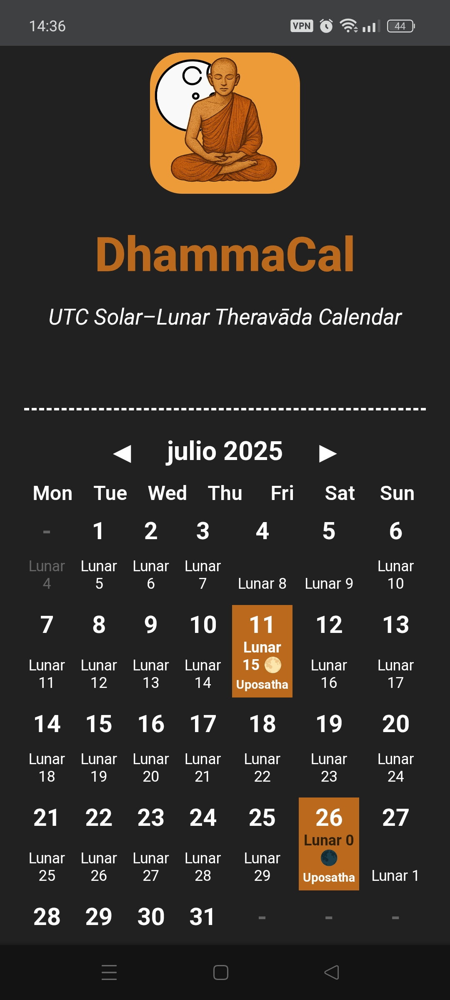

# About DhammaCal
<h2>Namo tassa bhagavato arahato sammā-sambuddhassa</h2>

👉 [https://dhammacal.netlify.app](https://dhammacal.netlify.app)

**DhammaCal** is a lightweight app designed to display two parallel Theravāda calendar views:

1. **A UTC-based lunar-solar calendar** – which shows full moon and new moon days using the Universal Time Coordinate (UTC) as reference.
2. **The Mahānikāya Uposatha Calendar** – based on the traditional Thai Forest Sangha's reckoning, showing Uposatha moon days (observance days) according to the Mahānikāya method.

---

The purpose of this app is to offer a quick and intuitive overview of both the **astronomically-based moon phases** and the **traditional Uposatha observance dates** as preserved in the Thai Forest Tradition.

<h3>Screenshot</h3>

The full Mahānikāya calendar, maintained by **Gambhīro Bhikkhu**, can be viewed online at:  
👉 [https://splendidmoons.github.io](https://splendidmoons.github.io)

For details on how Uposatha moon days are calculated using the Mahānikāya method, please see the open-source repository:  
👉 [https://github.com/profound-labs/calculating-the-uposatha-moondays](https://github.com/profound-labs/calculating-the-uposatha-moondays)

